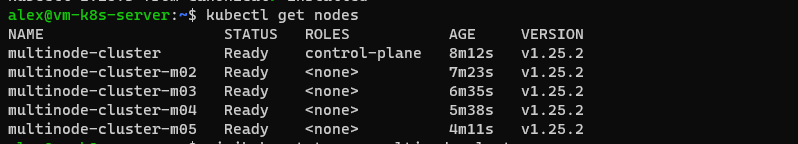

# Практикум: Задание D2.4.1, Задание D2.4.2

**Задание D2.4.1**
___
- Поднял ВМ в Яндекс Облаке (**Ubuntu 22.04**)
- Установил _**docker**_:
  - _sudo curl -fsSL https://get.docker.com -o get-docker.sh_
  - _sh get-docker.sh_
  - _sudo usermod -aG docker $USER_
- Установил _**Minikube**_:
  - _curl -LO https://storage.googleapis.com/minikube/releases/latest/minikube-linux-amd64_
  - _sudo install minikube-linux-amd64 /usr/local/bin/minikube_
- Запустил, указал количество нод - 5, имя - multinode-cluster:
  - _minikube start --nodes 5 -p multinode-cluster_
- Установил _**kubectl**_:
  - _sudo snap install kubectl --classic_
___
**Результаты выполнения команд**
- _kubectl get nodes_ - количество нод в кластере
- 
- _minikube status -p multinode-cluster_ - статус кластера
- 

