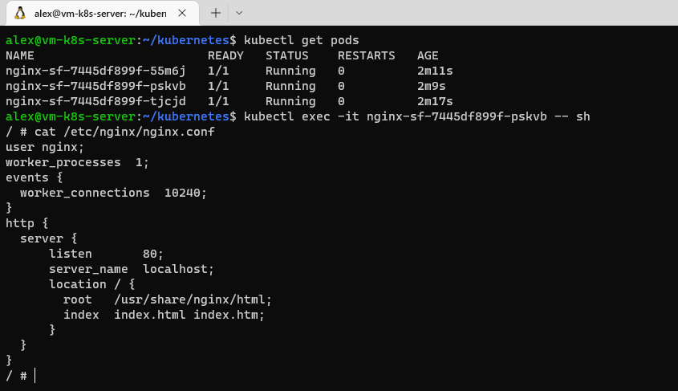
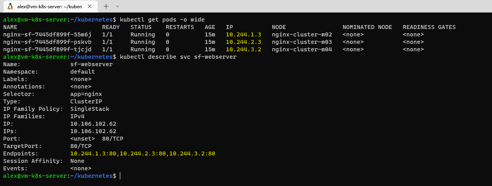
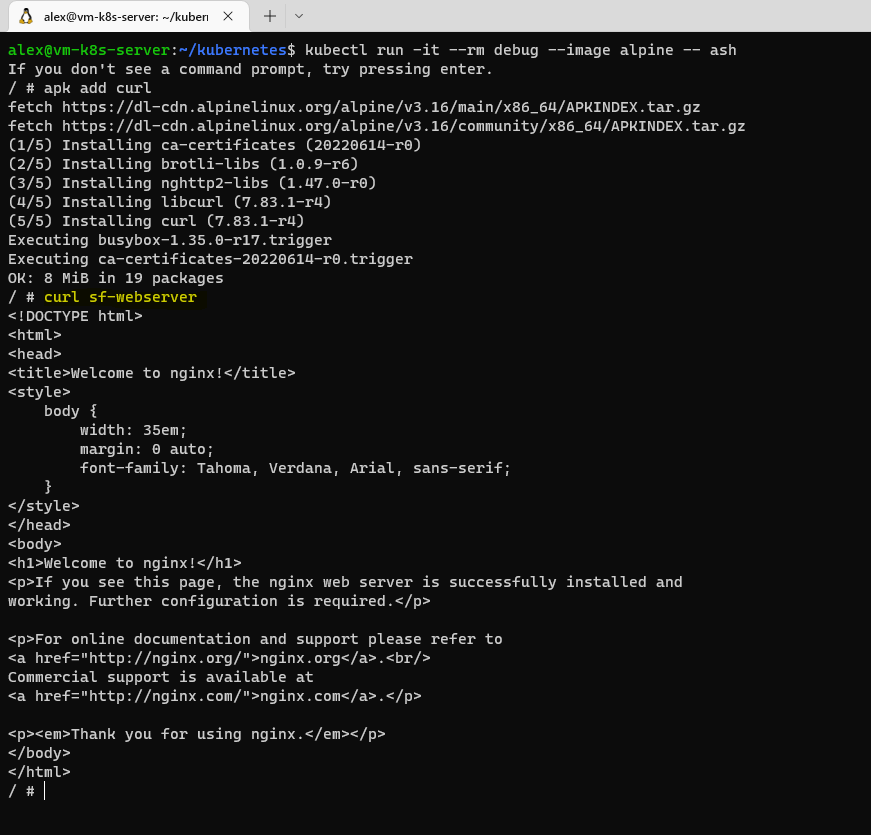
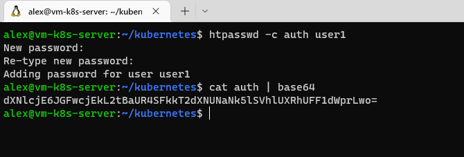

# Практикум: Задание D3.4

**Задание**
1. Создать Deployment со свойствами ниже:
- образ — _nginx:1.21.1-alpine;_
- имя — _nginx-sf;_
- количество реплик — _3._
___
- Развернул кластер на _minikube_. 
- Создал **deployment.yaml** с содержимым:
```
apiVersion: apps/v1
kind: Deployment
metadata:
  name: nginx-sf
  labels:
    app: nginx
spec:
  replicas: 3
  selector:
    matchLabels:
      app: nginx
  template:
    metadata:
      labels:
        app: nginx
    spec:
      containers:
      - name: nginx
        image: nginx:1.21.1-alpine
        ports:
        - containerPort: 80
```
- Применил конфиг с помощью команды - _kubectl apply -f deployment.yaml_
- 
___

2. Создать конфигурационный файл для нашего приложения и поместить его в наш Pod со следующими свойствами:
- путь до файла в Pod’е — /etc/nginx/nginx.conf;
- содержимое файла (указано в конфиге).
___
- Создал **configmap.yaml** с содержимым:
```
apiVersion: v1
kind: ConfigMap
metadata:
  name: nginx-config
data:
  nginx.conf: |
    user nginx;
    worker_processes  1;
    events {
      worker_connections  10240;
    }
    http {
      server {
          listen       80;
          server_name  localhost;
          location / {
            root   /usr/share/nginx/html;
            index  index.html index.htm;
          }
      }
    }
```
- Добавил в **deployment.yaml** следующую конфигурацию:
```
        volumeMounts:
        - name: config
          mountPath: "/etc/nginx"
          readOnly: true
      volumes:
      - name: config
        configMap:
          name: nginx-config
          items:
          - key: nginx.conf
            path: nginx.conf
```
- Применил конфигурацию - _kubectl apply -f ._
- Для проверки зашел в один из подов, и проверил конфиг _nginx_
- 
___
3. Создать service для того, чтобы можно было обращаться к любому из Pod’ов по единому имени:
- имя сервиса sf-webserver;
- внешний порт — 80.
___
- Создал **service.yaml** с содержимым:
```
apiVersion: v1
kind: Service
metadata:
  name: sf-webserver
spec:
  selector:
    app: nginx
  ports:
    - protocol: TCP
      port: 80
      targetPort: 80
```
- Применил конфигурацию - _kubectl apply -f ._
- Проверил присязку подов к сервису по 80-му порту
- 
- Проверил обращение к сервису по имени
- 
___
4. Создать секрет со следующими данными:
- имя секрета — auth_basic;
- ключ объекта в секрете — user1;
- значение объекта в секрете user1 — password1;
___
- Подготовил данные для секрета
- 
- Создал **secret.yaml** с содержимым:
```
apiVersion: v1
kind: Secret
metadata:
  name: auth-basic
type: Opaque
data:
  user1: dXNlcjE6JGFwcjEkL2tBaUR4SFkkT2dXNUNaNk5lSVhlUXRhUFF1dWprLwo=
```
