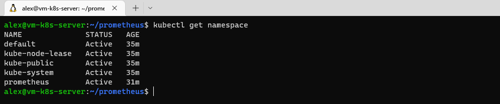
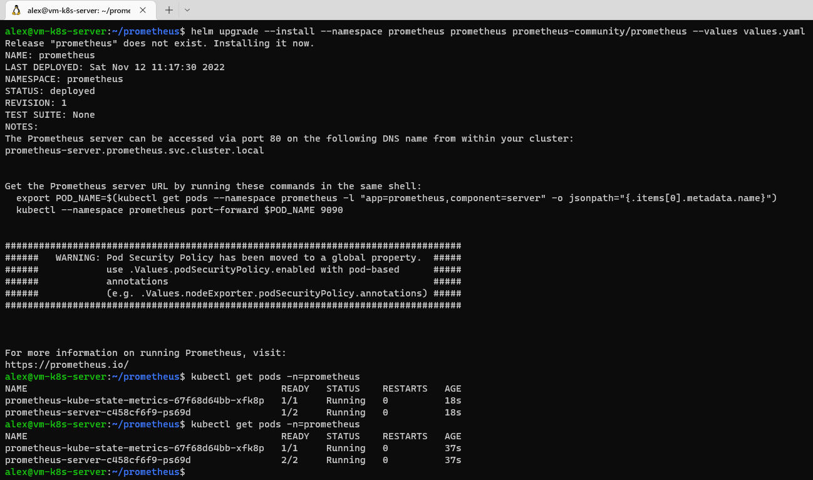

# ЗАДАНИЕ D5.2.3 (HW-03)

1. Создал **namespace** командой - _kubectl create ns prometheus_
- 

2. Создал файл _values.yaml_
```
alertmanager:
  enabled: false

nodeExporter:
  enabled: false

pushgateway:
  enabled: false
```
3. Установил чат
```
helm upgrade --install --namespace prometheus prometheus prometheus-community/prometheus --values values.yaml
```
4. Проверил результат
- 

