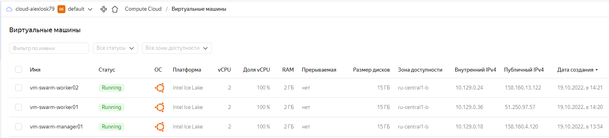
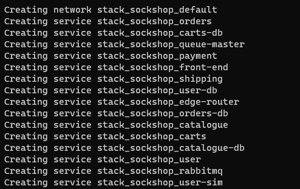
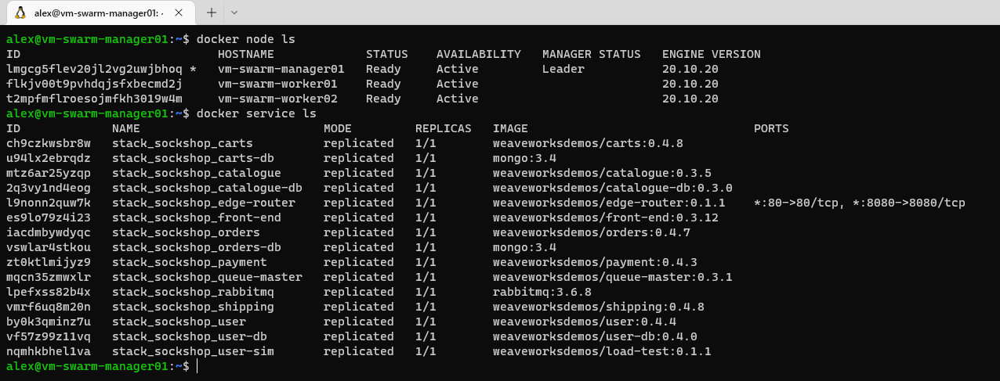
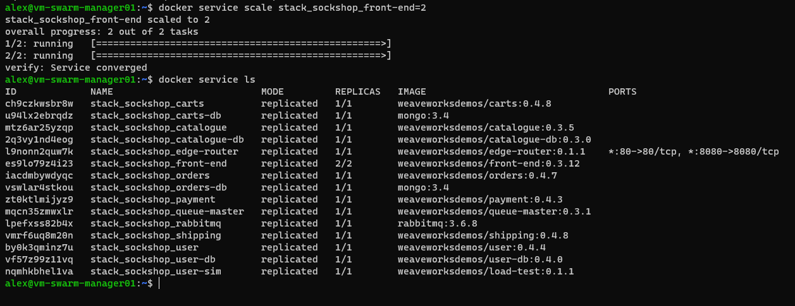

# HW-03-2(Sock Shop)

**1. Создал три инстанса в Yandex.Cloud**

___
**2. Установил на каждую Docker Engine и Docker Compose**
Для установки использовал команды:
- _sudo curl -fsSL https://get.docker.com -o get-docker.sh_   # Загрузка установочного скрипта
- _sh get-docker.sh_   # Запуск установочного скрипта
- _sudo usermod -aG docker $USER_   # Запуск Docker Engine без "sudo"
___
**3. Создал Docker Swarm кластер с одной управляющей нодой и двумя worker-нодами**
На управляющей ноде выполнил:
- _docker swarm init --advertise-addr 10.129.0.18_   # инициализировал и получил токен для подключения worker-нод
На worker-нодах выполнил:
- _docker swarm join --token SWMTKN-1-0fzgepkezjj155xokb3kh6ugg91cu5fsw52ht1hpq29f9c1jtp-6fwbxuz8nmkn262evugu0f0iq 10.129.0.18:2377_
___
**4. Задеплоил в swarm-кластер исправленный файл docker-compose.yml**
На управляющей ноде выполнил:
- _docker stack deploy --compose-file docker-compose.yml stack_sockshop_

___
**5. Проверка работы проекта через браузер**

___
**6. Вывод команд _docker node ls_ и _docker service ls_**

___
**7.Масштабирование frontend-сервиса до двух реплик**
На управляющей ноде выполнил:
- _docker service scale stack_sockshop_front-end=2_

