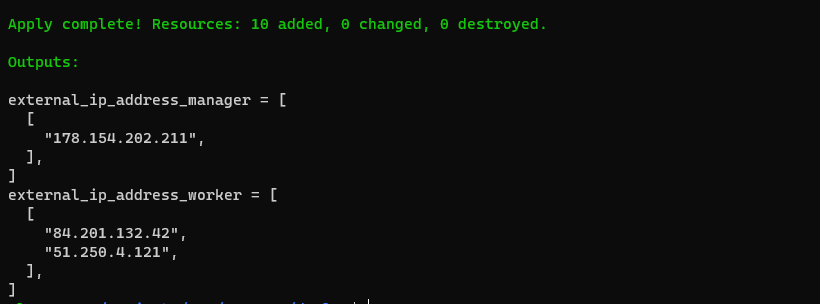
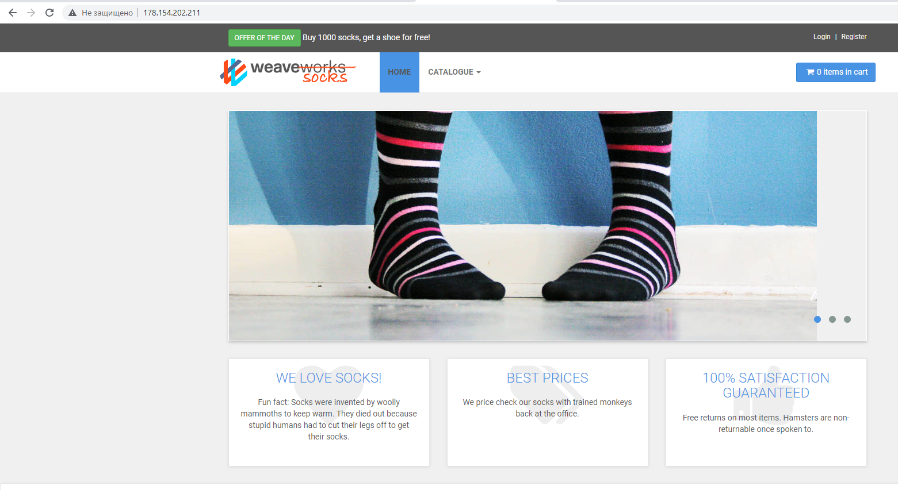
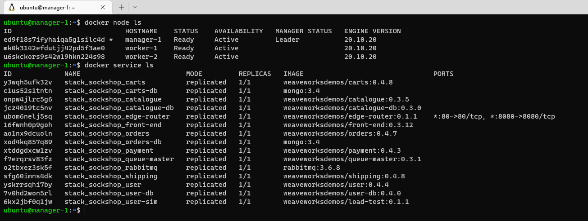

# HW-03-3(Sock Shop)
**Развертывание в Яндекс Облаке**
___
Требования:
- Аккаунт в Яндекс Облаке
- Установленный Terraform
___
Как развернуть:
- загрузить содержимое из удаленного репозитория
- перейти в каталог: _HW-03-3/deploy/_
- в файле **main.tf** внести свои значения:  
  - _token     = "Add token"_
  - _cloud_id  = "Add cloud_id"_
  - _folder_id = "Add folder_id"_
- перейти в каталог _HW-03-3/deploy/modules/instance_
- в файле **variables.tf** прописать свой приватный и публичный ключ:
  - _private_key = "~/.ssh/id_*"
  - _pub_key     = "~/.ssh/id_*.pub"
- вернуться в каталог _HW-03-3/deploy/_
- выполнить _terraform init_
- выполнить _terraform apply_
___
**Результат развертывания**
- терминал

- веб браузер

- управляющая нода

